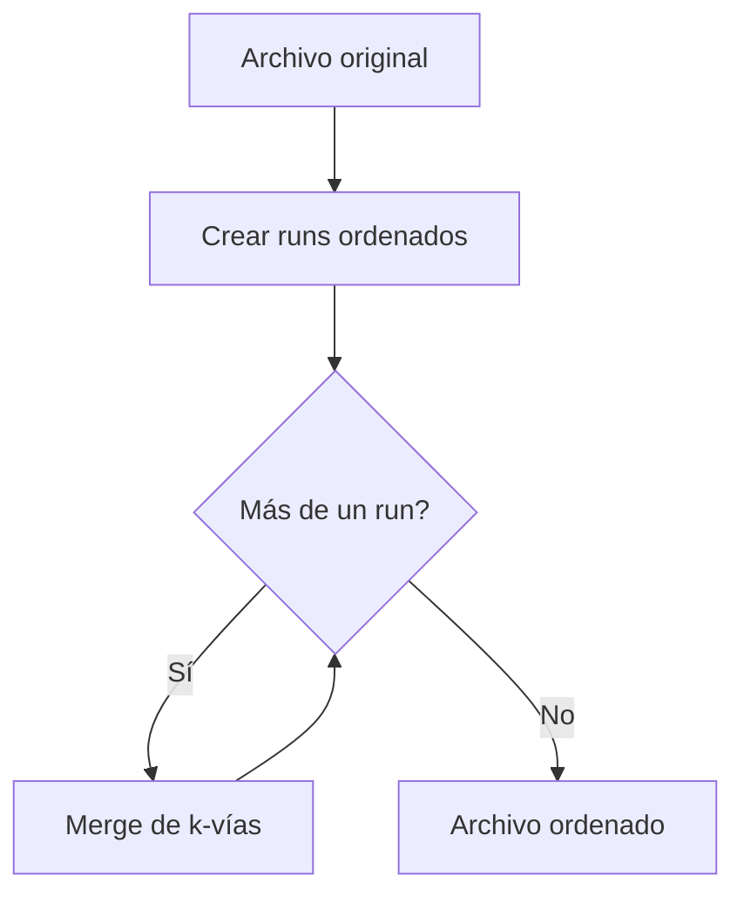

# Algoritmo Mergesort Externo - Documentación Técnica

## ¿Qué es el Mergesort Externo?

El Mergesort Externo es un algoritmo de ordenamiento diseñado para trabajar con archivos **demasiado grandes para caber en memoria RAM**. Su estrategia se basa en:

1. **Dividir** el archivo en segmentos ordenados (runs)
2. **Fusionar** gradualmente los segmentos en passes sucesivos
3. **Optimizar** el uso de memoria mediante un merge de k-vías

## ¿Cómo funciona? Explicación Paso a Paso

### 1. Creación de Runs Iniciales

Divide el archivo en segmentos ordenados del tamaño máximo que permite la memoria:

```cpp
vector<string> createInitialRuns(const string& inFile, size_t memBytes) {
    size_t intsPerRun = memBytes / sizeof(int64_t);
    vector<int64_t> buffer(intsPerRun);

    ifstream in(inFile, ios::binary);
    vector<string> runs;

    while(in.read(reinterpret_cast<char*>(buffer.data()), buffer.size() * sizeof(int64_t))) {
        size_t elementos_leidos = in.gcount() / sizeof(int64_t);
        sort(buffer.begin(), buffer.begin() + elementos_leidos); // Ordenamiento en memoria
        string nombre_run = inFile + "_run" + to_string(runs.size());
        // Guardar run ordenado
        ofstream(nombre_run, ios::binary).write(
            reinterpret_cast<char*>(buffer.data()),
            elementos_leidos * sizeof(int64_t)
        );
        runs.push_back(nombre_run);
    }
    return runs;
}
```

### 2. Merge de K-Vías

Combina múltiples runs usando una cola de prioridad (heap):

```cpp
void mergeRuns(vector<string>& runFiles, int arity) {
    priority_queue<
        pair<int64_t, int>,
        vector<pair<int64_t, int>>,
        function<bool(const auto&, const auto&)>
    > heap([](const auto& a, const auto& b){ return a.first > b.first; });

    vector<ifstream> archivos;
    for(auto& nombre : runFiles) {
        archivos.emplace_back(nombre, ios::binary);
        int64_t primer_elemento;
        if(archivos.back() >> primer_elemento) {
            heap.emplace(primer_elemento, archivos.size()-1);
        }
    }

    ofstream salida("resultado_temp.bin", ios::binary);
    while(!heap.empty()) {
        auto [valor, idx] = heap.top();
        heap.pop();
        salida.write(reinterpret_cast<char*>(&valor), sizeof(valor));

        if(archivos[idx] >> valor) {
            heap.emplace(valor, idx);
        }
    }
}
```

### 3. Proceso Recursivo



## Parámetros Clave

| Parámetro  | Función                                   | Valor Típico |
| ---------- | ----------------------------------------- | ------------ |
| `memBytes` | Máxima memoria usable                     | 50MB-1GB     |
| `arity`    | Número de runs a fusionar simultáneamente | 8-32         |
| `buffer`   | Bloque de lectura/escritura               | 4KB-1MB      |

## Ventajas vs Quicksort Externo

| Característica | Mergesort                  | Quicksort          |
| -------------- | -------------------------- | ------------------ |
| Estabilidad    | ✅ Mantiene orden relativo | ❌ No estable      |
| Rendimiento    | Predictivo                 | Depende de pivotes |
| Complejidad    | O(n log n) garantizado     | O(n²) en peor caso |

## Ejemplo de Uso

### Compilación:

```bash
g++ -std=c++17 main_mergesort.cpp external_mergesort.cpp -o mergesort_externo
```

### Ejecución:

```bash
./mergesort_externo datos.bin resultado.bin 50000000 8
```

Argumentos:

1. `datos.bin`: Archivo de entrada (int64_t)
2. `resultado.bin`: Archivo ordenado
3. `50000000`: Memoria máxima (50MB)
4. `8`: Aridad (runs a fusionar por paso)

## Casos de Uso Ideales

1. Ordenamiento de registros financieros históricos
2. Procesamiento de datasets científicos grandes
3. Sistemas con acceso secuencial rápido a disco

## Optimización de Performance

```cpp
// Técnica avanzada: Buffering de bloques
const size_t BUFFER_SIZE = 4 * 1024; // 4KB
vector<int64_t> buffer(BUFFER_SIZE/sizeof(int64_t));

while(!heap.empty()) {
    // Llenar buffer antes de escribir a disco
    fill(buffer.begin(), buffer.end(), [&]{ ... });
    salida.write(reinterpret_cast<char*>(buffer.data()), BUFFER_SIZE);
}
```

## Preguntas Frecuentes

### ¿Qué pasa si se agota el espacio en disco?

- El algoritmo crea archivos temporales en cada paso
- Necesita aproximadamente 2x el espacio del archivo original
- Recomendado: Usar disco dedicado para temporales

### ¿Cómo elegir la mejor aridad?

- Mayor aridad = menos passes pero más complejidad
- Valor óptimo depende del sistema de archivos:
  - HDD: 8-16
  - SSD/NVMe: 32-64
