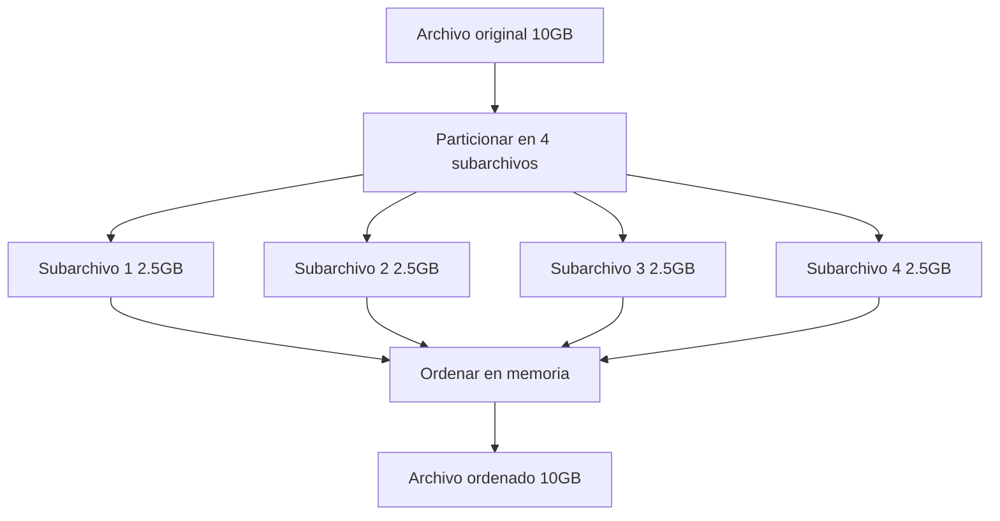

# Algoritmo Quicksort Externo - Documentación Técnica

## ¿Qué es el Quicksort Externo?

El Quicksort Externo es una variante del algoritmo clásico Quicksort adaptado para ordenar archivos **demasiado grandes para caber en la memoria RAM**. Funciona mediante:

1. **Partición recursiva** del archivo en segmentos más pequeños
2. **Ordenamiento en memoria** cuando los segmentos son suficientemente pequeños
3. **Combinación inteligente** de resultados parciales

## ¿Cómo funciona? Explicación Paso a Paso

### 1. Selección de Pivotes (Muestreo de Reservorio)

Para dividir el archivo en particiones balanceadas, seleccionamos `k-1` pivotes usando una técnica estadística llamada **Reservoir Sampling**:

```cpp
vector<int64_t> choosePivots(const string& filename, size_t memBytes, int parts) {
    size_t total = getFileSize<int64_t>(filename) / sizeof(int64_t);
    size_t samp = memBytes / sizeof(int64_t); // Tamaño de muestra

    vector<int64_t> res;
    ifstream in(filename, ios::binary);
    int64_t x;
    size_t seen = 0;

    while(in.read(reinterpret_cast<char*>(&x), sizeof(x))) {
        if(res.size() < samp) res.push_back(x);
        else if(rand() % seen < samp) res[rand() % samp] = x; // ¡Mágia estadística!
        seen++;
    }
    sort(res.begin(), res.end());
    // ... selección equidistante de pivotes
}
```

**¿Por qué funciona?**
Este método garantiza que los pivotes sean representativos de toda la distribución de datos, incluso si no caben en memoria.

### 2. Partición del Archivo

Usando los pivotes, dividimos el archivo original en `k` subarchivos:

```cpp
void partitionFile(...) {
    // 1. Crear archivos temporales
    for(int i=0; i<p; i++){
        string name = file + "_part" + to_string(i);
        ofstream(name, ios::binary).close();
    }

    // 2. Leer en bloques de tamaño controlado
    vector<int64_t> buf(bufInts);
    while(in.read(reinterpret_cast<char*>(buf.data()), buf.size() * sizeof(int64_t))){
        // 3. Clasificar cada elemento según los pivotes
        for(auto v : buf){
            int idx = lower_bound(pivots.begin(), pivots.end(), v) - pivots.begin();
            appendInts(outFiles[idx], {v});
        }
    }
}
```

### 3. Ordenamiento Recursivo

Cada partición se ordena independientemente:

```cpp
void externalQuicksort(...) {
    if(archivo_pequeño){
        sortInMemory(inFile, outFile); // ¡Ordenar en RAM!
    } else {
        // Repetir proceso recursivamente
        externalQuicksort(partición, subparticiones...);
    }
}
```

## ¿Por qué usar este enfoque? Ventajas Clave

| Ventaja                 | Explicación                                               |
| ----------------------- | --------------------------------------------------------- |
| **Bajo uso de memoria** | Solo carga bloques del tamaño especificado por `memBytes` |
| **Eficiencia en disco** | Minimiza lecturas/escrituras mediante búferes             |
| **Paralelismo natural** | Las particiones pueden procesarse independientemente      |

## Ejemplo de Uso en C++

### Compilación

```bash
g++ -std=c++17 main_quicksort.cpp external_quicksort.cpp -o quicksort_externo
```

### Ejecución

```bash
./quicksort_externo input.bin output.bin 50000000 4
```

Parámetros:

- `input.bin`: Archivo binario de entrada (int64_t)
- `output.bin`: Archivo ordenado resultante
- `50000000`: Memoria máxima a usar (50MB)
- `4`: Número de particiones

## Flujo de Datos Típico



## Preguntas Frecuentes

### ¿Qué pasa si los pivotes son malos?

El algoritmo incluye:

- Muestreo estadístico representativo
- Recursión hasta lograr particiones manejables
- Reordenación final al combinar resultados

### ¿Cómo maneja archivos enormes (>100GB)?

- Trabaja por bloques sin cargar el archivo completo
- Crea un árbol de particiones temporal
- Elimina archivos temporales automáticamente
